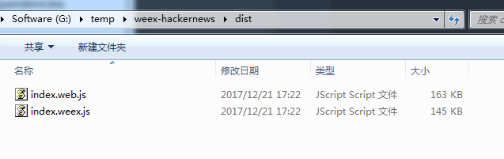
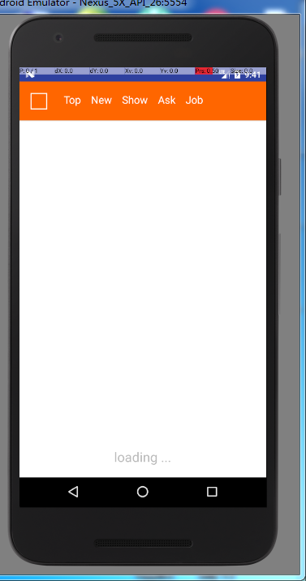

1. 下载官方 [Demo](https://github.com/weexteam/weex-hackernews)

2. 命令行进入weex-hackernews文件夹下，执行命令`npm install`安装依赖
执行命令`npm run build`或`npm run dev`编译weex-hackernews\src目录下的源码，
编译后的文件生成为js文件，在weex-hackernews\dist目录下

其中index.web.js用于网页端，index.weex.js用于android和iOS移动端

3. 将index.weex.js文件拷贝到Android项目assets目录下即可。

-------

##### 预览效果图如下：

[官方指导](http://weex.apache.org/cn/guide/)